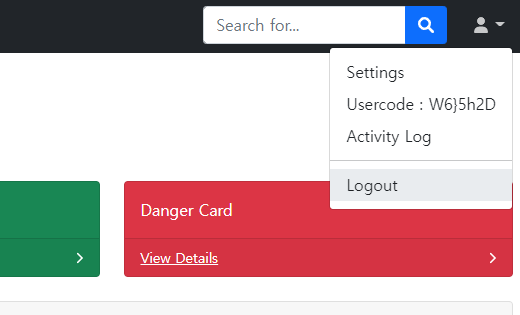
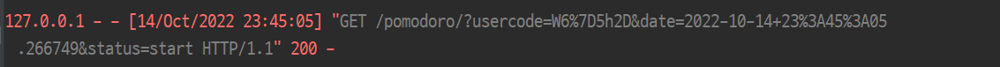

### pomodoro GUI
클래스로 frame을 사용하여 todolist를 붙여넣을 생각중이다 GUI에 대해 알면 알수록 기능들과 꾸미는 방법이 다양해서 아예 유튜브 강의를 통해 마음에 맞는 형식을 만들 예정이다.

### flask 웹 개발
웹의 기본적인 뼈대와 api 실험은 성공했다.

bootstrap으로 만들어진 탬플릿 대시보드를  flask로 로그인 등록 페이지 등을 연결하였고
아이디를 로그인하면

다음과 같이 usercode가 생성되면

api 서버로 request를 보내 성공적으로 데이터베이스에 포모도르 데이터와 연동하는데 성공하였다.

일단은 GUI를 더 다듬고 todolist를 붙이는 작업과 웹을 데이터와 연동하여 대시보드가 뜨도록 바꿀 것이다.

물론 로그인이 안되있어도 usercode만 있으면 서버와 교신이 가능하기 때문에
내가 GUI 포모도로를 쓰고 있다면 웹을 열지알아도 서버와 교신 후 내가 웹을 열면 나의 결과들이 웹에 대시보드 형태로 뜨게 할 생각이다

마지막으로는 최종적으로 자바를 처음 배우는데 이를 이용하거나 react등을 배워서 앱으로 스마트폰과 연동할 생각이다.

그리고 진행중에 느낀게 있다면 굳이 bootstrap 탬플릿을 가져와 연동할 필요가 없이 기본적이 뼈대 html에서 원하는 바를 만들고 
필요하면 그때 부트스트랩 탬플릿 양식을 가져와 쓰는 방법이 좀 더 개발 속도가 빠를 것 같다.

이유는 탬플릿 같은 경우 더 좋아보이는 게 나오기도 하고 탬플릿과 연동하느라 시간이 더 걸리는 것도 있기 때문이다.

GUI 또한 마찬가지로 처음부터 무작정 만들어보는 것보다 유투브에 무료강의가 널려있기 때문에 강의를 한번 듣고 깔끔하게 만들어보는 것이 좋을 거 같다.

마지막으로 나는 특히 개발자에게 데이터가 결국 중요하다고 생각한다. 내가 지금 코딩을 하는 시간도 공부하는 시간 같은 데이터와 포스트에 정리하는 일기들 같은 데이터가 쌓아서 이를 이용해 A.I와 같은 데이터 학습을 통해 맞춤형 서비스를 제공한다거나 하는게 가능하기 때문이다.